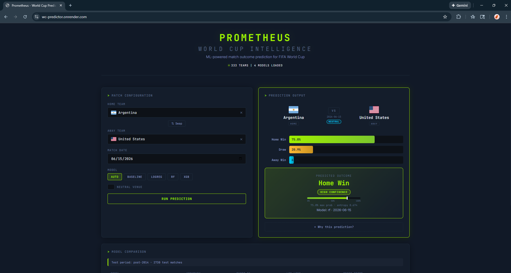

# Prometheus - World Cup Match Outcome Predictor

A full-stack ML application that predicts FIFA World Cup match outcomes using historical data, ELO ratings, and ensemble models. Features a production-grade Python pipeline with leak-free feature engineering, a FastAPI REST API, and a React frontend -- deployed on Render.

**[Live Demo](https://wc-predictor.onrender.com)**



---

## Highlights

- **64.4% accuracy** on 2,730 held-out matches (2015--present) using temporal train/test splits
- **Leak-free feature engineering** -- every feature for match *i* uses only data from matches with `date < date_i`
- **4 models compared** with proper baselines, log loss, Brier score, and calibration analysis
- **Full-stack web app** -- React frontend with cyberpunk UI, FastAPI backend, Docker deployment
- **64 unit tests** covering ELO correctness, leakage prevention, probability consistency, and metric computation
- **Production hardened** -- rate limiting, global exception handling, secret scanning, same-origin CORS

## Tech Stack

| Layer | Technology |
|---|---|
| **ML Pipeline** | Python, scikit-learn, XGBoost, pandas, NumPy |
| **Backend** | FastAPI, Pydantic, Uvicorn |
| **Frontend** | React 18, Vite, vanilla CSS |
| **Deployment** | Docker (multi-stage), Render |
| **Testing** | pytest (64 tests) |
| **Data** | 49,000+ international matches (1872--present) |

## Architecture

```
Browser (React SPA)
    |
    |  /api/predict, /api/teams, /api/models, /api/comparison, /api/version
    v
FastAPI  ──>  Precomputed ELO Cache  ──>  sklearn Pipeline  ──>  JSON Response
    |              (startup)                (inference)         w/ explainability
    |
    v
Static File Server (serves built React app from same origin)
```

### ML Pipeline

```
Raw Data (49k matches)
    |
    v
ELO Rating System (K=32, home advantage=100, neutral venue handling)
    |
    v
Leak-Free Feature Engineering (41 features)
  - ELO ratings + ELO-derived win probabilities
  - Rolling form (last 3/5/10 matches): win rate, goals for/against
  - Head-to-head record (last 5 meetings)
  - Confederation encoding (UEFA, CONMEBOL, etc.)
  - Neutral venue flag
    |
    v
Temporal Split (train <= 2014, test > 2014)
    |
    v
Model Training (Pipeline: Imputer -> Scaler -> Classifier)
    |
    v
Evaluation (accuracy, macro F1, log loss, Brier score, calibration plots)
```

## Results

| Model | Accuracy | Macro F1 | Log Loss | Brier Score |
|---|---|---|---|---|
| Baseline (most frequent) | 0.477 | 0.215 | 18.08 | 1.047 |
| Logistic Regression | 0.639 | 0.503 | 0.808 | 0.469 |
| **Random Forest** | **0.644** | 0.481 | **0.805** | **0.468** |
| XGBoost | 0.626 | **0.519** | 0.881 | 0.500 |

*Train: 6,989 matches (up to 2014). Test: 2,730 matches (2015+). Cutoff is configurable via `--cutoff`.*

> The baseline's log loss (~18) is intentionally extreme: `DummyClassifier` outputs 100% for one class, producing near-infinite log loss on misclassified samples. This is the correct worst-case reference point.

## API

### Endpoints

| Method | Path | Description |
|---|---|---|
| `GET` | `/api/health` | Health check (teams/models loaded) |
| `GET` | `/api/teams` | List all teams in the dataset |
| `GET` | `/api/models` | Available models with metrics |
| `POST` | `/api/predict` | Predict match outcome (rate limited: 30/min) |
| `GET` | `/api/comparison` | Model comparison table with metadata |
| `GET` | `/api/version` | Build info, dataset hash, git commit |

### Example Request

```bash
curl -X POST https://wc-predictor.onrender.com/api/predict \
  -H "Content-Type: application/json" \
  -d '{"home_team": "Brazil", "away_team": "Germany", "match_date": "2026-06-15", "neutral": true}'
```

### Example Response

```json
{
  "home_team": "Brazil",
  "away_team": "Germany",
  "probabilities": { "H": 0.4521, "D": 0.2473, "A": 0.3006 },
  "prediction": "H",
  "prediction_label": "Home Win",
  "confidence": { "max_prob": 0.4521, "entropy": 1.0412, "label": "MED" },
  "explanation": {
    "elo": { "home_elo": 1843.2, "away_elo": 1829.7, "elo_diff": 13.5 },
    "home_form_last5": { "W": 3, "D": 1, "L": 1 },
    "head_to_head": { "home_wins": 2, "draws": 1, "away_wins": 2 }
  }
}
```

## Frontend Features

- **Searchable team dropdowns** with country flags (261 teams mapped via flagcdn.com CDN)
- **Probability bar visualization** with color-coded outcome bars
- **Confidence scoring** -- HIGH / MED / LOW badge based on Shannon entropy and max probability
- **"Why this prediction?"** expandable explainability card showing ELO, form (W/D/L), head-to-head, and confederation context
- **Model comparison table** with sortable columns and baseline reference tags
- **Swap button** to quickly reverse home/away teams
- **Responsive dark theme** (cyberpunk/HTB-inspired)

## Quick Start

### Prerequisites

- Python 3.11+
- Node.js 18+ (for frontend development)

### Run Locally

```bash
# Install everything
make setup

# Run the full ML pipeline
make download        # Fetch match data
make features        # Engineer features (with qualifiers)
make train           # Train all 4 models
make evaluate        # Generate comparison reports

# Start the web app (two terminals)
make api             # Terminal 1: FastAPI on :8000
make frontend        # Terminal 2: React dev server on :5173

# Open http://localhost:5173
```

### Run Tests

```bash
make test
# 64 tests: ELO correctness, leakage prevention, probability consistency, metrics
```

### Run a Single Prediction (CLI)

```bash
python -m wc_predictor.predict --team_a Brazil --team_b Germany --date 2026-06-15
```

## Project Structure

```
.
├── src/wc_predictor/
│   ├── api.py              # FastAPI backend (CORS, rate limiting, static serving)
│   ├── config.py           # Paths, constants, ELO params, confederation map
│   ├── elo.py              # Sequential ELO rating system
│   ├── features.py         # Leak-free feature engineering (41 features)
│   ├── splits.py           # Temporal splits + multi-class metrics
│   ├── train.py            # Model training (sklearn Pipelines)
│   ├── evaluate.py         # Model comparison + calibration plots
│   ├── predict.py          # Single-match prediction + precomputation cache
│   ├── download_data.py    # Dataset downloader + validator
│   └── build_dataset.py    # Filter to WC matches, add labels
├── frontend/
│   ├── src/
│   │   ├── App.jsx         # Main app (data fetching, state management)
│   │   ├── components/     # PredictionForm, ResultsCard, ModelComparison, TeamFlag
│   │   ├── utils/flags.js  # Flag URL helpers + coverage checker
│   │   └── data/           # 261-team ISO code mapping
│   └── vite.config.js      # Dev proxy to FastAPI
├── tests/                  # 64 tests (ELO, features, splits, predictions)
├── data/                   # Raw + processed match data
├── artifacts/              # Trained models (.joblib) + evaluation reports
├── Dockerfile              # Multi-stage build (Node + Python)
├── render.yaml             # Render Blueprint (auto-deploy)
└── Makefile                # Build targets
```

## Design Decisions

| Decision | Rationale |
|---|---|
| **Temporal split, not random** | Random splits leak future data into training. Temporal splits mimic real-world deployment where you predict future matches from past data. |
| **ELO over all matches, features over WC only** | ELO ratings need volume to converge. Computing ELO over 49k matches gives accurate ratings; features are only built for the ~9.7k WC-related matches. |
| **Precomputed ELO cache at startup** | Replaying 40k ELO updates per request was too slow. One-time precomputation at startup reduces prediction latency from ~500ms to <10ms. |
| **Baseline log loss is intentionally high** | `DummyClassifier` outputs [1,0,0] for every sample. `log(0)` after clipping to 1e-15 produces ~18. This is the correct worst-case reference, not a bug. |
| **Same-origin deployment** | Serving React from FastAPI eliminates CORS complexity, avoids split-deployment issues, and provides a single URL. |
| **Graceful XGBoost fallback** | The pipeline works without XGBoost installed (it's optional). This improves portability across environments. |

## Limitations

- **No player-level data**: Team strength is approximated via ELO and form. Injuries, suspensions, and squad composition are not captured.
- **Stationarity assumption**: Historical patterns may not transfer to future tournaments as football evolves.
- **Class imbalance**: Draws are the least frequent outcome and hardest to predict.
- **Educational purposes only**: This model should not be used for gambling or financial decisions.

## Future Work

1. **Player-level features** -- squad market values, average age, key player availability
2. **Tournament structure features** -- round, group standings, goal difference
3. **Bayesian calibration** -- replace ad-hoc draw band with properly calibrated ordinal regression
4. **Hyperparameter tuning** -- Bayesian optimization over K-factor, form windows, and model params
5. **Conformal prediction** -- prediction sets with guaranteed coverage instead of point probabilities

## License

MIT
